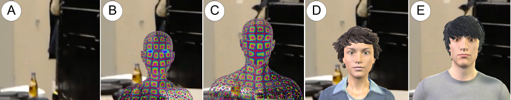

# Embedding Conversational Agents into AR: Invisible or with a Realistic Human Body?
Currently, (invisible) smart speech assistants, such as Siri, Alexa, and Cortana, are used by a constantly growing number of people. Moreover, Augmented Reality (AR) glasses are predicted to become widespread consumer devices in the future. Hence, smart assistants can easily become common applications of AR glasses, which allows for giving the assistant a visual representation as an embodied agent. While previous research on embodied agents found a user preference for a humanoid appearance, research on the uncanny valley suggests that simply designed humanoids can be favored over hyper-realistic humanoid characters. In a user study, we compared agents of simple versus more realistic appearance (seen through AR glasses) versus an invisible state-of-the-art speech assistants (see Figure 1). Our results indicate that a more realistic visualization is preferred as it provides additional communication cues, such as eye contact and gaze, which seem to be key features when talking to a smart assistant. But if the situation requires visual attention, e.g., when being mobile or in a multitask situation, an invisible agent can be more appropriate as they do not distract the visual focus, which can be essential during AR experiences.

This repository contains the subjective data and the analysis for the conducted study. See more details in the <a href="Paper_Embedding Conversational Agents into AR.pdf">paper</a>.

<i>Reinhardt, J., Hillen, L., & Wolf, K. (2020, February). Embedding Conversational Agents into AR: Invisible or with a Realistic Human Body?. In Proceedings of the Fourteenth International Conference on Tangible, Embedded, and Embodied Interaction (pp. 299-310).</i>
