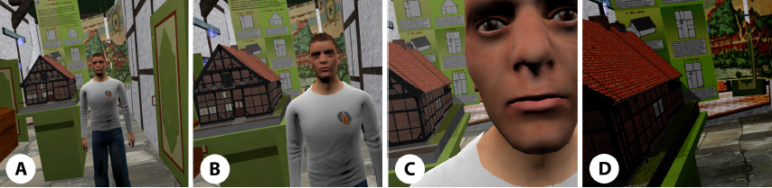

# Go-Through: Disabling Collision to Access Obstructed Paths and Open Occluded Views in Social VR
Social Virtual Reality (VR) offers new opportunities for designing social experiences, but at the same time, it challenges the usability of VR as other avatars can block paths and occlude one’s avatar’s view. In contrast to designing VR similar to the physical reality, we allow avatars to go through and to see through other avatars. In detail, we vary the property of avatars to collide with other avatars. To better understand how such properties should be implemented, we also explore multimodal feedback when avatars collide with each other. Results of a user study show that multimodal feedback on collision yields to a significantly increased sensation of presence in Social VR. Moreover, while the loss of collision (the possibility to go through other avatars) causes a significant decrease of felt co-presence, qualitative feedback showed that the ability to walk through avatars can ease to access spots of interest. Finally, we observed that the purpose of Social VR determines how useful the possibility to walk through avatars is. We conclude with design guidelines that distinguish between Social VR with a priority on social interaction, Social VR supporting education and information, and hybrid Social VR enabling education and information in a social environment.

This repository contains the subjective data collected within the study described in the paper as well as the according analysis. See more details in the <a href="PaperGo-Through.pdf">paper</a>.