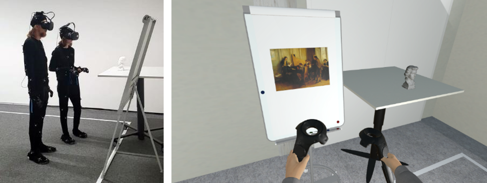

# It’s Not Always Better When We’re Together: Effects of Being Accompanied in Virtual Reality
Virtual reality (VR) enables immersive applications that make rich content available independent of time and space. By replacing or supplementing physical face-to-face meetings, VR could also radically change how we socially interact with others. Despite this potential, the effect of transferring physical collaborative experience into a virtual one is unclear. Therefore, we investigated the experience differences between a collaborative virtual environment (CVE) and a physical environment. We used a museum visit as a task since it is a typical social experience and a promising use case for VR. 48 participants experienced the task in real and virtual environments, either alone or with a partner. Despite the potential of CVEs, we found that being in a virtual environment has adverse effects on the experience which is reinforced by being in the environment with another person. Based on quantitative and qualitative results, we provide recommendations for the design of future multi-user virtual environments.

The file <a href="Questionnaire-Data.xlsx">Questionnaire-Data.xlsx</a> contains the data collected through questionnaires. The file <a href="average distance between pairs.csv">average distance between pairs.csv</a> contains the average distance between pairs of participants. See more details in the <a href="Its-Not-Always-Better-When-Were-Together.pdf">paper</a>.
