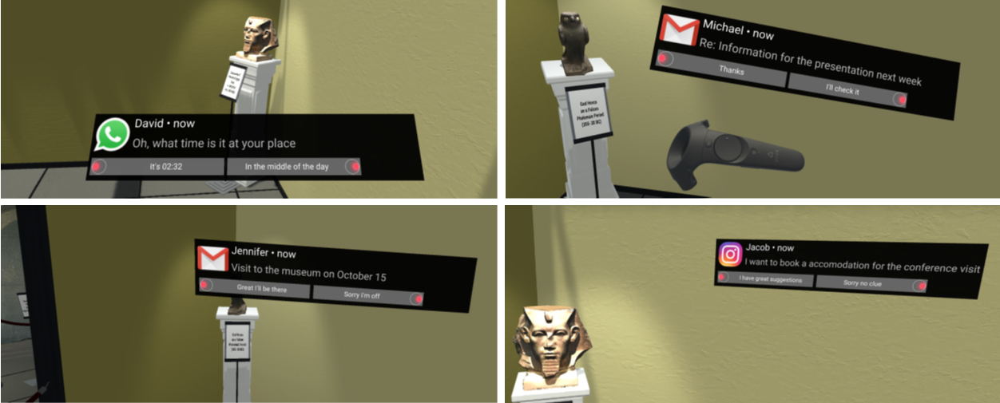

# Notification in VR: The Effect of Notification Placement, Task, and Environment
Virtual reality (VR) is commonly used for entertainment applications but is also increasingly employed for a large number of use cases such as digital prototyping or training workers. Here, VR is key to present an immersive secondary world. VR enables experiences that are close to reality, regardless of time and place. However, highly immersive VR can result in missing digital information from the real world, such as important notifications. For efficient notification presentation in VR, it is necessary to understand how notifications should be integrated in VR without breaking the immersion. Thus, we conducted a study with 24 participants to investigate notification placement in VR while playing games, learning, and solving problems. We compared placing notifications using a Head-Up Display, On-Body, Floating, and In-Situ in open, semi-open, and closed VR environments. We found significant effects of notification placement and task on how notifications are perceived in VR. Insights from our study inform the design of VR applications that support digital notifications.

The respository subjective and objective data collected within the study. See more details in the <a href="Notification-in-VR.pdf">paper</a>.
