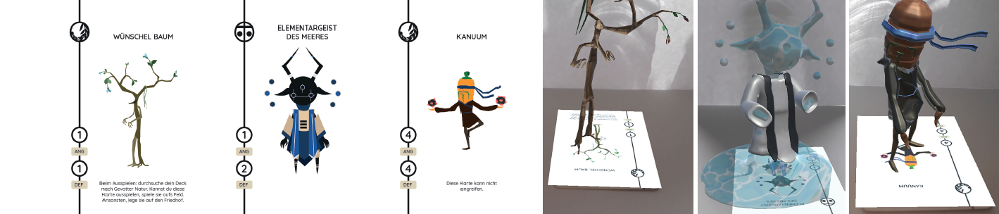

# PLAY ME! Influencing Game Decisions through Suggestions made by Augmented Characters
During physical games, we love to socially interact with other players through bluffing or giving them hits. This work aims to enrich AR characters by adding a suggestive behavior to them intended to playfully influence game decisions. In a user study, we evaluated such behaviors presented as body postures by animated card characters using an AR trading card game. Our results indicate that AR characters can indeed influence the player’s game decisions through postures that encourage or discourage to play a certain card. Our approach enriches the game design space, can make the game more interesting, and finally adds a social component to the game.

This repository contains the data collected within the study described in the paper as well as the according analysis. See more details in the <a href="Paper_PLAY_ME__Influencing_Game_Decisions_through_Suggestions_made_by_Game_Card_Characters.pdf">paper</a>.

<i>Kurzweg, M., Reinhardt, J., Stoll, M., Wirth, J., & Wolf, K. (2020, November). PLAY ME! Influencing Game Decisions through Suggestions made by Augmented Characters. In 19th International Conference on Mobile and Ubiquitous Multimedia (pp. 288-298).</i>
