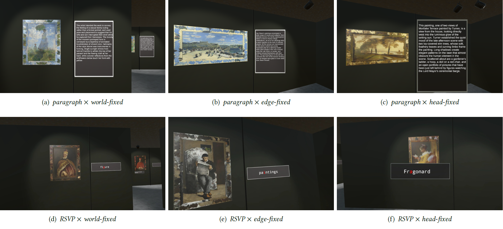

# Reading in VR: The Efect of Text Presentation Type and Location
Reading is a fundamental activity to obtain information both in the real and the digital world. Virtual reality (VR) allows novel approaches for users to view, read, and interact with a text. How-ever, for efcient reading, it is necessary to understand how a text should be displayed in VR without impairing the VR experience. Therefore, we conducted a study with 18 participants to investigate text presentation type and location in VR.We compared world-fxed, edge-fxed, and head-fxed text locations. Texts were displayed using Rapid Serial Visual Presentation (RSVP) or as a paragraph. We found that RSVP is a promising presentation type for reading short texts displayed in edge-fxed or head-fxed location in VR. The paragraph presentation type using world-fxed or edge-fxed location is promis-ing for reading long text if movement in the virtual environment is not required. Insights from our study inform the design of reading interfaces for VR applications.

The file <a href="ReadingInVRData.csv"ReadingInVRData.csv</a> contains the subjective and objective data collected within the study. See more details in the <a href="reading-in-vr-the-effect-of-text-presentation-type-and-location.pdf">paper</a>.
