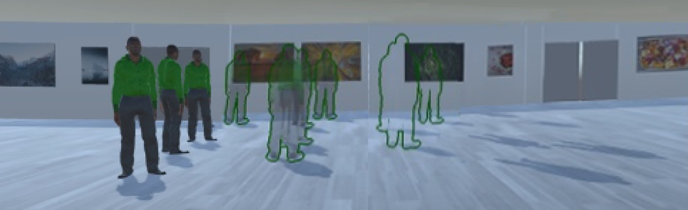

# SocialSlider: Changing the Transparency of Avatars affects their Co-Presence
Due to the constantly growing number of users, social virtual reality (VR) can be overcrowded. As we sometimes prefer to be only surrounded by close friends or as we more enjoy empty galleries to have a better view, we introduce SocialSlider: an interaction technique that allows us to fade avatars’ visibility and to make them transparent. We implemented SocialSliderwith four techniques to select avatars that shall be made invisible or faded out: (1) select a single avatar, (2) select all, (3) select a group of avatars standing together, or (4) select a semantic group, such as unknown users. Through a user study, we found that (A) The concept of SocialSlider is appreciated and promising to overcome crowded VR. (B) The level of transparency of avatars affects their perceived co-presence. (C) Pointing at oneself is a gesture of poor usability as it lacks ergonomics.

This repository contains the subjective data collected within the study described in the paper as well as the according analysis. See more details in the <a href="Paper_SocialSlider.pdf">paper</a>.

<i>Reinhardt, J., & Wolf, I. K. (2018). Opportunities of Social VR in Digital Museum Twins. EVA BERLIN 2018, 320.</i>
