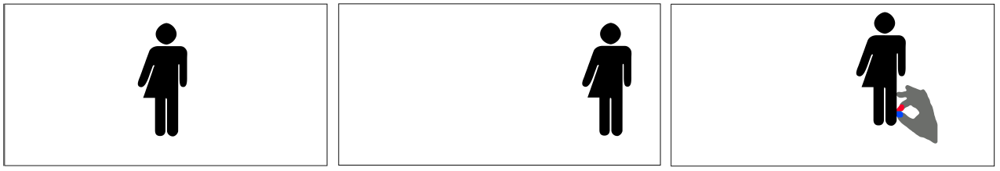

# Placement of Teleported Co-Users in AR
Teleportation and conversations with virtual representations of remote people have been made possible by recent developments in augmented reality (AR) technology. This paper aims at understanding how such AR telecommunication systems should be implemented by asking where to display 3D scans of potential remote users. As the perfect interaction design solution may be different while walking versus while staying in one place, we conducted a user study comparing both. We also varied the placement of the remote user in the co-user's field of view (FoV) and where the coordinate system in which the 3D scan is visualized has its origin. We found that remote users we talk to should, in general, be visualized in AR in front of us, but in situations in which the physical world requires attention a visualization in the periphery is better. Re-placing the co-user through gestures is not desired, but the ability to look away from them should be supported, which strongly supports placing virtual co-users in AR relatively to the user's body.

This repository contains the subjective data and the analysis for the conducted study. See more details in the <a href="Paper_Placement_of_Teleported_Co_Users_in_AR.pdf">paper</a>.
