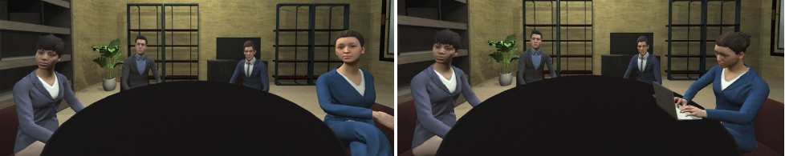

# Using Body Language of Avatars in VR Meetings as Communication Status Cue
While traditional videoconferencing causes privacy issues, virtual meetings are not yet widely used. Their communication quality still lacks usability and important non-verbal communication cues, such as body language, are underrepresented. We aim at exploring virtual avatars’ body language and how it can be used to indicate meeting attendees’ communication status. By comparing users’ perceptions of avatar behavior, we found that avatar body language across gender can be an indication of communication willingness. We derive  resulting body language design recommendations and recommend using attentively behaving avatars as default body language and to indicate being busy through actions of the avatar, such as drinking, typing, or talking on a phone. These actions indicate that users are temporarily busy with another task, but still are attending the meeting. When users are unavailable, their avatars should not be displayed  at all and in cases of longer meeting interruptions, the avatar of a user should leave the virtual meeting room.

This repository contains the subjective data collected within the study described in the paper. See more details in the <a href="Paper_Using Body Language.pdf">paper</a>.