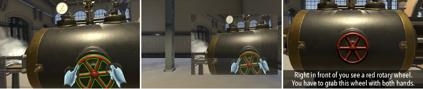

# Virtual Physical Task Training: Comparing Shared Body, Shared View and Verbal Task Explanation
While video lectures are very successful in explaining theoretical aspects, Virtual Reality (VR) also offers the possibility to teach physical skills. While a large body of research focuses on virtual teaching explaining tasks during the task completion, it remains unclear what type of task instructions work best before task execution.  In this paper, we compare three virtual teaching methods: purely verbal explanation, explanation by observing the trainer’s activity  from exactly their perspective (shared-body), and explanation by observing the task execution in a shared view overlay within one’s  view. Our quantitative results show that the purely verbal explanation can result in slower task replication for some tasks, e.g., path drawing in the air. Our qualitative results indicate that shared-body and shared view techniques work well but can be improved through additional verbal explanations. Moreover, task instruction might be hard to remember, which can be avoided through in-situ instructions or splitting the tasks into sub-tasks and letting the trainees replicate shorter physical actions.

This repository contains the subjective and objective data collected within the study. See more details in the <a href="Paper_Virtual_Physical_Task_Training__Comparing_Shared_Body__Shared_View_and_Verbal_Task_Explanation.pdf">paper</a>.